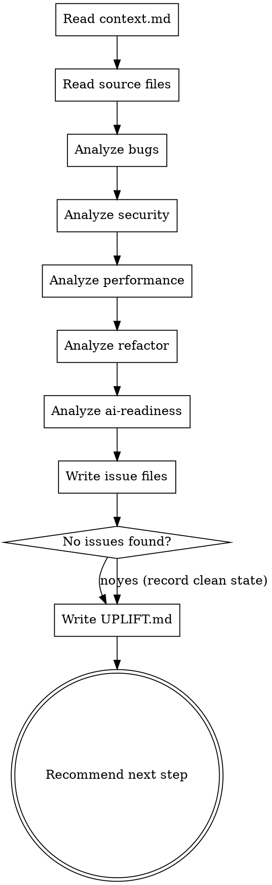

# Uplift Audit

## Overview

Read the entire codebase. Find real problems across five dimensions. Write one file per issue. Build a prioritized action plan.

**Announce at start:** "I'm using the uplift-audit skill to analyze this codebase."

<HARD-GATE>
Do NOT begin the audit without `docs/uplift/context.md`. If it's missing, run uplift-init first.
</HARD-GATE>

<HARD-GATE>
Do NOT propose or apply any fixes during this skill. Audit only. Fixes happen in dedicated fix skills.
</HARD-GATE>

## Checklist

You MUST create a task for each item and complete them in order:

1. **Detect GitNexus** — check index and MCP registration; use MCP tools if available, fall back to direct reading if not
2. **Read context.md** — load project context before touching source files
3. **Read source files** — skip non-source directories
4. **Analyze: bugs** — logic errors, null dereferences, race conditions, incorrect error handling
5. **Analyze: security** — injection, auth issues, secrets, insecure dependencies, missing validation
6. **Analyze: performance** — N+1 queries, blocking I/O, memory leaks, inefficient algorithms
7. **Analyze: refactor** — dead code, duplication, god objects, unclear naming, missing abstractions
8. **Analyze: ai-readiness** — missing CLAUDE.md, magic numbers, undocumented logic, unclear naming
9. **Write one issue file per finding**
10. **Write docs/uplift/UPLIFT.md** — summary, priority table, dependency graph, next step

## Process Flow



## Step-by-Step

### 1. Detect GitNexus

Run two checks via Bash before deciding the scan method:

**Check A — Index:**
```bash
ls .gitnexus/ 2>/dev/null && echo "indexed" || echo "not indexed"
```

**Check B — MCP registration:**
```bash
claude mcp list 2>/dev/null | grep -i gitnexus && echo "mcp registered" || echo "mcp missing"
```

Then attempt to call the GitNexus MCP `list_repos` tool (or any tool matching the `gitnexus` MCP namespace). If it responds: MCP is live. If it errors or the tool is not in scope: MCP is not live.

**Decision table:**

| Index | MCP | Mode |
|---|---|---|
| ✓ | ✓ | **GitNexus MCP** — use MCP tools for all five dimensions |
| ✓ | ✗ | **Direct file read** — index exists but MCP not registered or Claude Code not restarted after setup |
| ✗ | ✓ | **Direct file read** — MCP registered but no index; tell user to run `npx gitnexus analyze` |
| ✗ | ✗ | **Direct file read** — GitNexus not set up; refer to `/uplift-init` |

Report before proceeding:
```
Scan method: GitNexus MCP  (index: .gitnexus/ ✓  mcp: live ✓)
```
or:
```
Scan method: direct file read
  Note: {specific reason — e.g., "MCP not registered: run `gitnexus setup` and restart Claude Code"
         or "index not found: run `npx gitnexus analyze`"}
```

**If GitNexus MCP is live**, use these MCP tools for the five analysis dimensions instead of reading files directly. Do NOT call `gitnexus query` via Bash — it is read-only and broken:

| Dimension | MCP tools | Query approach |
|---|---|---|
| Bugs | `query` | "unhandled promise rejections", "missing null checks before property access", "swallowed errors in catch blocks" |
| Security | `query` + `context` | "string interpolation in SQL or database queries", "routes without authentication middleware", "hardcoded credentials or tokens". Use `context` on suspicious symbols to confirm callers before filing critical issues — prevents false positives. |
| Performance | `query` | "database queries inside loops", "missing pagination or result limits", "synchronous blocking operations in async code" |
| Refactor | `query` | "functions longer than 50 lines", "duplicated code blocks", "deeply nested conditionals" |
| AI-Readiness | `query` | "magic numbers in business logic", "single-letter variable names outside loops", "functions with misleading or unclear names" |

Use `impact` on every critical finding to assess blast radius before filing — high blast radius → raise severity.

Use `detect_changes` if the repo has recent commits — surfaces issues introduced by recent changes and helps prioritize.

**If GitNexus MCP is not available**, proceed with direct file reading as described in the following steps.

### 2. Read context.md

Read `docs/uplift/context.md`. Note:
- Stack and framework — shapes what bugs and patterns to look for
- Test coverage status — if no tests, flag every finding as higher risk
- Any gaps reported at init time

### 3. Read Source Files

Walk the source tree. Skip:
`node_modules/`, `.git/`, `dist/`, `build/`, `__pycache__/`, `.next/`, `vendor/`, `target/`, `coverage/`, `*.min.js`, `*.lock`

Read every source file. For large projects (> 100 files), prioritize:
1. Entry points and main controllers/handlers
2. Auth, session, and payment-related code
3. Database access and query layers
4. Files with the most dependents

### 4–8. Five Analysis Dimensions

For each dimension, think like a senior engineer who has seen this bug cause a production incident. Don't flag style preferences. Flag real risks.

**Bugs**
- Null / undefined dereferences without guards
- Off-by-one errors in loops or pagination
- Incorrect async/await usage (missing await, unhandled promises)
- Error swallowing (`catch (e) {}` with no handling)
- Incorrect type coercion
- Race conditions in concurrent code
- Wrong HTTP status codes returned
- Mutations of shared state without locks

**Security**
- SQL / NoSQL injection (string interpolation in queries)
- Command injection (unsanitized user input in shell calls)
- XSS (unescaped output in HTML templates)
- Hardcoded secrets, tokens, or passwords in source
- Missing authentication on routes/endpoints
- Missing authorization checks (can user A access user B's data?)
- Insecure direct object references
- Missing input validation at API boundaries
- CORS misconfiguration
- Sensitive data logged

**Performance**
- N+1 queries (DB call inside a loop)
- Synchronous I/O blocking an async event loop
- Unbounded result sets (no pagination, no LIMIT)
- Missing database indexes on frequently queried columns
- Large payloads loaded fully into memory
- Redundant computations inside hot loops
- Missing caching for expensive repeated lookups

**Refactor**
- Functions > 50 lines doing multiple things
- Duplicated logic across files (same code copied 2+ times)
- God objects or modules with 10+ unrelated responsibilities
- Deeply nested conditionals (> 3 levels)
- Magic numbers and magic strings with no explanation
- Dead code — functions, routes, variables never referenced
- Inconsistent naming conventions within the same module

**AI-Readiness**
- No `CLAUDE.md` at project root
- Non-obvious business logic with no explanation comment
- Magic numbers without named constants
- Abbreviations in identifiers that aren't obvious (`proc`, `mgr`, `tmp`, `d`)
- Functions that do something surprising given their name
- Files > 300 lines with mixed concerns

> **Category names:** Use lowercase for file paths and table values. Use Title-Case for `### Heading` in UPLIFT.md.
> Mapping: `bugs` → `### Bugs`, `security` → `### Security`, `performance` → `### Performance`,
> `refactor` → `### Refactor`, `ai-readiness` → `### AI-Readiness`.

### 9. Write One Issue File Per Finding

For every real finding, write a file to the appropriate category directory:

**Path:** `docs/uplift/{category}/{YYYY-MM-DD}-{slug}.md`

Categories: `bugs`, `security`, `performance`, `refactor`, `ai-readiness`

Slug: lowercase, hyphen-separated, descriptive (e.g., `missing-await-in-payment-handler`, `sql-injection-user-search`)

**File format:**

```markdown
# {Title}

**Severity:** critical | high | medium | low
**Secrets-related:** yes  *(include this line only for findings involving hardcoded secrets, credentials, tokens, API keys, or passwords)*

**File:** {path/to/file.ext} (line {X}–{Y})

**Impact:** {one sentence — what breaks or risks occurring if this is not fixed}

## Problem

{2–4 sentences explaining WHY this is a problem. Not just what it does — why it matters.
Think: what incident does this cause? What attacker exploits this? What user experiences the bug?}

## Suggested Fix

{Concrete direction for how to fix it. Do NOT write the fixed code here — that happens in the fix skill.
Point to the right approach: "use parameterized queries", "add null check before accessing .user.id",
"extract this into a named constant". One short paragraph.}

---

**Status:** pending

<!--
  pending     — not yet started
  in-progress — fix is being applied in the current session
  done        — fix applied and verified
  skipped     — deferred by user decision (add a note explaining why)
  wont-fix    — intentionally not addressing (add a note explaining the decision)
-->
```

**Severity definitions:**
- `critical` — data loss, security breach, or crash in normal usage
- `high` — significant user-facing bug or exploitable vulnerability under realistic conditions
- `medium` — degraded behavior, technical debt with real cost, or theoretical risk
- `low` — minor, cosmetic, or unlikely-to-matter in practice

**Do not write an issue file for:**
- Personal style preferences
- Things that "could be improved" with no real cost if left alone
- Issues already covered by a linter or formatter


### 10. Write docs/uplift/UPLIFT.md

Populate the Scan Coverage table with:
- Date: today's date
- Method: GitNexus MCP or direct read (whichever was used)
- Target: "full project"
- Files: "{N scanned}/{N total}" for direct read; "all (graph)" for GitNexus MCP
- Status: "complete" if all files were reached; "partial" if context limit caused skips

Under "Gaps", list every directory that was skipped or not fully read.
If GitNexus was used, write "Full project analyzed via knowledge graph — no gaps."

```markdown
# Uplift Audit Results
Generated: {YYYY-MM-DD}

## Recommended Next Step

**{skill-name}** — {one sentence explanation of why this is the highest-value action right now}

{If no test coverage: include this block}
> **No test coverage detected.** Proceeding with code changes is high-risk.
> Consider writing tests for the areas you plan to modify before running any fix skill.

## Summary

| Category | Critical | High | Medium | Low | Total |
|---|---|---|---|---|---|
| Bugs | {n} | {n} | {n} | {n} | {n} |
| Security | {n} | {n} | {n} | {n} | {n} |
| Performance | {n} | {n} | {n} | {n} | {n} |
| Refactor | {n} | {n} | {n} | {n} | {n} |
| AI-Readiness | {n} | {n} | {n} | {n} | {n} |

## Issue Index

### Bugs

| Title | Severity | Status | Impact |
|---|---|---|---|
| [slug title](bugs/YYYY-MM-DD-slug.md) | critical \| high \| medium \| low | pending | one-line impact summary |

### Security

| Title | Severity | Status | Impact |
|---|---|---|---|
| [slug title](security/YYYY-MM-DD-slug.md) | critical \| high \| medium \| low | pending | one-line impact summary |

### Performance

| Title | Severity | Status | Impact |
|---|---|---|---|
| [slug title](performance/YYYY-MM-DD-slug.md) | critical \| high \| medium \| low | pending | one-line impact summary |

### Refactor

| Title | Severity | Status | Impact |
|---|---|---|---|
| [slug title](refactor/YYYY-MM-DD-slug.md) | critical \| high \| medium \| low | pending | one-line impact summary |

### AI-Readiness

| Title | Severity | Status | Impact |
|---|---|---|---|
| [slug title](ai-readiness/YYYY-MM-DD-slug.md) | critical \| high \| medium \| low | pending | one-line impact summary |

## Dependency Order

{Which fixes should happen before others — written as natural prose, not a rigid sequence.
Example: "Fix the SQL injection in user-search before addressing performance — the performance
fix touches the same query layer and a clean security fix will simplify that work."}

{If no issues found: "No issues found. The codebase is in good shape."}

## Scan Coverage

| Date | Method | Target | Files | Status |
|---|---|---|---|---|
| {YYYY-MM-DD} | {GitNexus MCP \| direct read} | full project | {N scanned}/{N total} | {complete \| partial} |

### Gaps
{If direct read and files were skipped:}
{- `{directory}/` — {N} files not scanned (reason: context limit)}
{- `{directory}/` — {N} files not scanned (reason: deprioritized)}

Run `/uplift-scan {path}` to cover these areas.

{If GitNexus MCP: "Full project analyzed via knowledge graph — no gaps."}
```

## Coverage Report

After writing `UPLIFT.md`, always show a coverage summary:

```
Scan coverage:

Method: {GitNexus MCP | direct file read}

Scanned:
  ✓ {N} files analyzed
  ✓ {list of directories covered}

Not scanned:
  {If GitNexus MCP: "All files analyzed via knowledge graph — no coverage gaps"}
  {If direct read and project > 100 files:}
  ⚠ {directory/} — {N} files (skipped: context limit reached)
  ⚠ {directory/} — {N} files (deprioritized: likely not source code)

  Run /uplift-scan {path} to extend coverage to these areas.
```

If using GitNexus MCP: coverage is complete by default — report this explicitly.
If using direct read: list every directory that was skipped or partially read.

## Recommended Next Steps

After writing `UPLIFT.md`, build a prioritized list based on what was found, then ask the user to choose:

```
━━━━━━━━━━━━━━━━━━━━━━━━━━━━━━━━━━━━━━━━
  NEXT STEP
━━━━━━━━━━━━━━━━━━━━━━━━━━━━━━━━━━━━━━━━
[1] /uplift-fix      — {N} issues pending ({dominant category} has highest priority)
[2] /uplift-summary  — generate a report of current findings (no fixes applied yet)
━━━━━━━━━━━━━━━━━━━━━━━━━━━━━━━━━━━━━━━━
  Enter number or command:
```

Replace `{N}` with the total pending count. Replace `{dominant category}` with whichever category has the highest-severity pending issues (e.g., "security — 1 critical" or "bugs — 3 high").

If no issues were found: show only `/uplift-summary`.

**If secrets are detected in source**, override the normal menu and show this instead:

```
━━━━━━━━━━━━━━━━━━━━━━━━━━━━━━━━━━━━━━━━
🚨  CRITICAL: SECRETS IN SOURCE
━━━━━━━━━━━━━━━━━━━━━━━━━━━━━━━━━━━━━━━━
  [1] /uplift-fix — go to security category, rotate credentials immediately
  [2] /uplift-audit     — run after secrets are handled
━━━━━━━━━━━━━━━━━━━━━━━━━━━━━━━━━━━━━━━━
  Enter number or command:
```

**Ordering:** Show `/uplift-fix` first if any issues were found (it handles all categories and priorities internally). Show `/uplift-summary` last.

If no test coverage: prepend this line before the numbered list:

```
⚠ No test coverage detected — every fix skill carries regression risk.
  Consider writing tests first, then return to this list.
```

Wait for the user's choice before doing anything.

## Red Flags

| Thought | Reality |
|---|---|
| "I'll just fix this one small thing while I'm here" | Audit only. Fix skills exist for a reason. Don't mix them. |
| "This is probably fine" | If you're uncertain, flag it as low. Let the user decide. |
| "There are too many issues, I'll summarize" | Write every real issue as its own file. The index exists for overview. |
| "I can't find any issues" | You haven't looked hard enough, or the codebase is genuinely clean. Both are valid. State which. |
| "I'll skip security because there's no auth" | No auth IS a security issue. Flag it. |

## Example Trigger Phrases

- "Audit this project"
- "Find all the issues in this codebase"
- "What's wrong with this code?"
- "Review the code and tell me what needs fixing"
- "Run a full audit"

## Verification Checklist

Before marking this skill complete:

- [ ] `docs/uplift/context.md` was read before starting
- [ ] All source files were read (not just a sample)
- [ ] Each of the five dimensions was analyzed
- [ ] Every real finding has its own issue file — no bundled issues
- [ ] Every issue file has severity, file + line, impact, problem, suggested fix, and `Status: pending`
- [ ] `docs/uplift/UPLIFT.md` Issue Index updated — one entry per new issue with severity, status, and impact
- [ ] `docs/uplift/UPLIFT.md` exists with the summary table filled in
- [ ] Exactly one next step is recommended with a reason
- [ ] No code was written or modified during this skill
