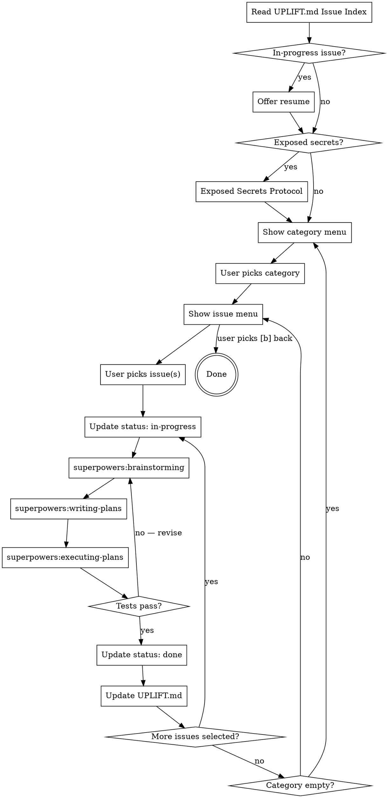

# Uplift Fix

## Overview

Show pending issues across all categories, ordered by priority. Let the user pick what to fix. Execute fixes using the Superpowers flow. Update issue status after each fix.

**Announce at start:** "I'm using the uplift-fix skill to work through pending issues."

<HARD-GATE>
Do NOT run without `docs/uplift/UPLIFT.md` containing at least one `pending` entry in the `## Issue Index` section. If UPLIFT.md is missing, tell the user to run `/uplift-audit` first.
</HARD-GATE>

<HARD-GATE>
Do NOT apply any code change without going through `superpowers:executing-plans`. No shortcut edits.
</HARD-GATE>

<HARD-GATE>
If any issue has `**Status:** in-progress`, offer to resume that issue before showing the category menu.
</HARD-GATE>

## Checklist

1. **Read UPLIFT.md Issue Index** — one read, all issues: `## Issue Index` section in `docs/uplift/UPLIFT.md`
2. **Check for in-progress issues** — offer resume if found
3. **Check for exposed secrets** — scan all pending issue files for `**Secrets-related:** yes` field; trigger protocol if found
4. **Show category menu** — ordered by priority
5. **User picks category** → show issue menu for that category
6. **User picks issue(s)** → execute fix flow
7. **For each issue: brainstorm → plan → execute → update status**
8. **Update UPLIFT.md** after each fix
9. **Loop** — return to issue menu (or category menu if category is now empty)

## Process Flow



## Step-by-Step

> **Category names:** UPLIFT.md headings use Title-Case (`### Security`), but menus, paths, and status updates
> use lowercase (`security`, `docs/uplift/security/`).
> Mapping: `### Bugs` → `bugs`, `### Security` → `security`, `### Performance` → `performance`,
> `### Refactor` → `refactor`, `### AI-Readiness` → `ai-readiness`.

### 1. Read UPLIFT.md Issue Index

Read **one file**: `docs/uplift/UPLIFT.md`. Parse the `## Issue Index` section.

The Issue Index uses **Markdown tables**. Each `### {Category}` section contains a table with columns `Title`, `Severity`, `Status`, and `Impact`:

```
### Bugs

| Title | Severity | Status | Impact |
|---|---|---|---|
| [Missing await in payment handler](bugs/2026-05-22-missing-await-payment.md) | critical | pending | Payment may process twice |
```

Extract from each row: the link text (title), link path (file path), Severity cell, Status cell, and Impact cell. Derive category from the `### {Category}` heading above the table. Filter to rows where `Status` is `pending` or `in-progress`. Use this data to build all menus — do NOT read individual issue files at this stage.

When updating status after a fix: update the `Status` cell in the table row for that issue — change `pending` to `in-progress`, then `in-progress` to `done` (or `skipped`).

**Fallback:** If UPLIFT.md is missing or has no Issue Index section, fall back to reading individual files under `docs/uplift/{category}/`.

### 2. Check for In-Progress Issues

If any issue has `**Status:** in-progress`, show:

```
━━━━━━━━━━━━━━━━━━━━━━━━━━━━━━━━━━━━━━━━
  RESUME?
━━━━━━━━━━━━━━━━━━━━━━━━━━━━━━━━━━━━━━━━
  Found an in-progress issue from a previous session:

  [{Title}] ({category}, {severity})
  File: {path}

  [1] Resume this issue
  [2] Start fresh from the category menu
  [q] Quit uplift-fix
━━━━━━━━━━━━━━━━━━━━━━━━━━━━━━━━━━━━━━━━
```

If user picks 1: jump to step 5 (Superpowers flow) for that issue.
If user picks 2: continue to step 3.

### 3. Exposed Secrets Protocol

Before displaying any menu, scan all pending issue files for the `**Secrets-related:** yes` field (present in the issue file's header). If any pending issue has this field, trigger the exposed-secrets protocol for that issue before allowing any code edits.

If any pending issue has `**Secrets-related:** yes`:

```
🚨 Exposed secret detected in source code.

This is an active security incident, not a routine code fix.

File: {path} (line {X})
Type: {API key / password / token / etc.}

A secret committed to source may already be compromised — even if the commit
is in history, the secret must be treated as exposed from the moment it was committed.

Required actions (in order):
1. Revoke or rotate the secret immediately in the service that issued it
2. Remove the secret from source and replace with an environment variable
3. Verify `.env` is listed in `.gitignore` — if not, add it now
4. Verify the secret does not appear in any previous commit (git history search)
5. If in a public repo: assume the secret is already compromised

Do NOT just delete the line and commit. The secret is still in git history.

━━━━━━━━━━━━━━━━━━━━━━━━━━━━━━━━━━━━━━━━
  Has this secret been rotated?
  (yes / not yet / not actually a secret)
━━━━━━━━━━━━━━━━━━━━━━━━━━━━━━━━━━━━━━━━
```

Wait for the user's response before proceeding. Do not remove the secret from source until it has been rotated.

### 4. Show Category Menu

Compute the priority order (see Ordering Rules below). Show all categories that have at least one pending issue:

```
━━━━━━━━━━━━━━━━━━━━━━━━━━━━━━━━━━━━━━━━
  CHOOSE A CATEGORY
━━━━━━━━━━━━━━━━━━━━━━━━━━━━━━━━━━━━━━━━
[1] security     — 1 critical, 2 high      ← recommended
[2] bugs         — 2 critical, 3 high
[3] performance  — 0 critical, 4 high, 2 medium
[4] refactor     — 0 critical, 1 high, 4 medium
[5] ai-readiness — 0 critical, 0 high, 6 medium

Reasoning: {one sentence explaining why the top category is recommended}

  [q] Quit uplift-fix
  Enter number:
━━━━━━━━━━━━━━━━━━━━━━━━━━━━━━━━━━━━━━━━
```

Show only non-empty categories. If only one category has issues, skip the menu and go straight to the issue menu for that category.

### 5. Show Issue Menu

After the user picks a category, show all pending issues in that category sorted by severity:

```
━━━━━━━━━━━━━━━━━━━━━━━━━━━━━━━━━━━━━━━━
  {category} — {N} pending
━━━━━━━━━━━━━━━━━━━━━━━━━━━━━━━━━━━━━━━━
[1] critical  SQL injection in user search
    File   : src/api/users.ts:42–58
    Impact : Attacker can read/modify any user record

[2] high     Missing auth on /admin routes
    File   : src/routes/admin.ts:1–24
    Impact : Anonymous users can hit admin endpoints

[3] high     Hardcoded API token
    File   : src/config/external.ts:8
    Impact : Token exposed in git history

[a] Fix all in order
[b] Back to category menu
[q] Quit uplift-fix

  Enter number, "a", or "b":
━━━━━━━━━━━━━━━━━━━━━━━━━━━━━━━━━━━━━━━━
```

If user picks `[b]`: return to the category menu. Do not change any issue status.

If user picks a number or "a": proceed to step 6.

### 6. For Each Selected Issue: Brainstorm → Plan → Execute → Update

Process each selected issue in order (critical first, then high, medium, low; ties by file path alphabetically).

#### 6a. Update status to in-progress

Read the individual issue file (first time reading the full file). Then make two updates:

1. **Issue file** — change:
   ```
   **Status:** pending
   ```
   To:
   ```
   **Status:** in-progress
   Started: {YYYY-MM-DD}
   ```

2. **UPLIFT.md Issue Index** — update the `status` field for this entry from `pending` to `in-progress`.

This ensures the session can be resumed if interrupted.

#### 6b. Fast-Track Check (skip brainstorming for trivial fixes)

**Fast-track (skip brainstorming):** An issue qualifies for fast-track if ALL three conditions are met:
1. Severity is `low` or `medium`
2. Category is `refactor` or `ai-readiness`
3. The fix touches a single file

For fast-track issues, skip `superpowers:brainstorming` and go directly to `superpowers:writing-plans` →
`superpowers:executing-plans`. All other issues MUST go through the full three-step flow.

Rationale: brainstorming is most valuable when there are cross-cutting tradeoffs or security implications.
Single-file cosmetic and readability fixes have predictable outcomes.

#### 6c. Invoke superpowers:brainstorming

**REQUIRED SUB-SKILL** (skip for fast-track issues — see 6b above). Invoke via the `Skill` tool with this prompt context:

> "We need to fix this issue: {full issue content — title, severity, file, impact, problem, suggested fix}.
> The codebase context is in docs/uplift/context.md.
> Brainstorm 2–3 approaches before committing to one. Consider: correctness, risk, test coverage, scope."

Do not proceed to the next step until brainstorming has converged on an approach.

#### 6d. Invoke superpowers:writing-plans

**REQUIRED SUB-SKILL.** Invoke via the `Skill` tool with this prompt context:

> "Write an implementation plan for fixing: {issue title}.
> Agreed approach: {outcome of brainstorming}.
> The plan MUST follow TDD discipline: write failing test → watch it fail → implement fix → watch test pass → refactor if needed.
> Include unit tests for edge cases, not just the happy path — the fix is only complete when the edge cases that caused the bug are also covered."

Wait for the user to approve the plan before proceeding.

#### 6e. Invoke superpowers:executing-plans

**REQUIRED SUB-SKILL.** Invoke via the `Skill` tool.

This executes the approved plan with TDD. Do not apply any code changes outside of this skill's execution.

#### 6f. After execution succeeds

If tests pass and execution completes, make two updates:

1. **Issue file** — replace:
   ```
   **Status:** in-progress
   Started: {YYYY-MM-DD}
   ```
   With:
   ```
   **Status:** done
   Fixed: {YYYY-MM-DD}
   Change: {one sentence describing what was changed and why it matters}
   ```

2. **UPLIFT.md Issue Index** — update the `status` field for this entry to `done`.

If the user declines to fix during brainstorming or planning:

1. **Issue file** — replace:
   ```
   **Status:** in-progress
   Started: {YYYY-MM-DD}
   ```
   With:
   ```
   **Status:** skipped
   Reviewed: {YYYY-MM-DD}
   Reason: {user's reason, or "declined during planning"}
   ```

2. **UPLIFT.md Issue Index** — update the `status` field for this entry to `skipped`.

### 7. Update UPLIFT.md

After each fixed or skipped issue, update the `## Summary` count table: decrement pending, increment done or skipped for that category row.

### 8. Loop

After updating UPLIFT.md:
- If more issues were selected: return to step 6 for the next one
- If the category still has pending issues: return to the issue menu (step 5)
- If the category is now empty: return to the category menu (step 4)
- If all categories are empty: show the done message and recommend `/uplift-summary`

```
━━━━━━━━━━━━━━━━━━━━━━━━━━━━━━━━━━━━━━━━
  All pending issues resolved.
━━━━━━━━━━━━━━━━━━━━━━━━━━━━━━━━━━━━━━━━
  Run /uplift-summary to generate a session report.
━━━━━━━━━━━━━━━━━━━━━━━━━━━━━━━━━━━━━━━━
```

## Ordering Rules

**Category priority** — applied in this order:
1. Categories with `critical` issues; among those: `security` → `bugs` → `performance` → `refactor` → `ai-readiness`
2. Categories with only `high` issues; same internal order
3. Categories with only `medium` issues; same internal order
4. Categories with only `low` issues; same internal order

Rationale: security criticals are exploitable now; bug criticals crash in normal use; performance criticals degrade all users; refactor and ai-readiness carry no immediate risk.

**Within a category:** `critical` → `high` → `medium` → `low`. Within the same severity, sort by file path alphabetically for predictability.

## Red Flags

| Thought | Reality |
|---|---|
| "The fix is small, I'll just edit the file directly" | All code changes go through superpowers:executing-plans. No exceptions. |
| "I'll skip brainstorming for obvious fixes" | Obvious fixes have non-obvious tradeoffs. Brainstorm first. |
| "One happy-path test is enough" | The edge cases are where the bug lived. A fix without edge case tests guarantees a regression. |
| "I'll update the status after all issues are done" | Update after each issue. Sessions get interrupted. |
| "The user picked a category, so I should fix everything in it" | Show the issue menu first. The user picks individual issues or "all". |
| "I'll recommend the most interesting fix, not the highest priority" | Priority order is fixed. Recommend by priority, not interest. |
| "Refactor issues can't be fixed here" | They can now. Same flow. |

## Example Trigger Phrases

- "Fix the issues you found"
- "Let's fix the bugs"
- "What should we fix next?"
- "Fix all the critical issues"
- "I want to start fixing things"
- "Run uplift fix"

## Verification Checklist

Before marking this skill complete:

- [ ] `docs/uplift/UPLIFT.md` Issue Index was read at the start (not individual files)
- [ ] In-progress issues were surfaced before showing menus
- [ ] Exposed secrets were handled before any code changes
- [ ] Category menu was ordered by priority with reasoning shown
- [ ] Every fix went through brainstorming → writing-plans → executing-plans
- [ ] Every fixed issue has `**Status:** done` with `Fixed:` date and `Change:` summary
- [ ] Every skipped issue has `**Status:** skipped` with `Reviewed:` date and `Reason:`
- [ ] UPLIFT.md Issue Index `status` updated after each fix
- [ ] UPLIFT.md summary table counts are updated after each fix
- [ ] Plan included edge case unit tests, not just the happy path
- [ ] No code was changed outside of superpowers:executing-plans
