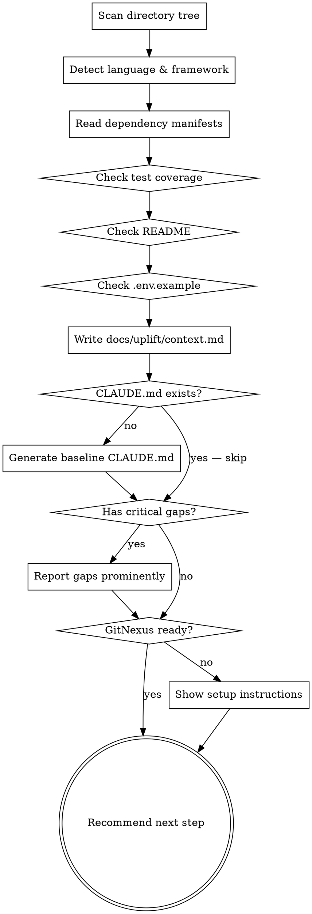

# Uplift Init

## Overview

Scan the project. Build a shared context file. Every other Uplift skill reads this file before doing anything — don't skip it.

**Announce at start:** "I'm using the uplift-init skill to scan this project."

<HARD-GATE>
Do NOT run any other Uplift skill until `docs/uplift/context.md` exists and is accurate. All other skills depend on it.
</HARD-GATE>

## Checklist

You MUST create a task for each item and complete them in order:

1. **Scan project structure** — directories, entry points, config files
2. **Detect stack** — language(s), framework(s), runtime, package manager
3. **Read dependency manifests** — package.json, requirements.txt, go.mod, Cargo.toml, Gemfile, pom.xml, etc.
4. **Check for test coverage** — any test directory, test files, or test runner config
5. **Check for README** — exists? up to date? or empty/missing?
6. **Check for .env.example** — exists? matches actual .env keys?
7. **Write `docs/uplift/context.md`**
8. **Generate baseline `CLAUDE.md`** — create at project root if missing; skip if already exists
9. **Report missing baselines** — loud and clear
10. **GitNexus Setup** — check Node, index, and MCP registration status; if any missing, show one instruction box with all setup steps (install, analyze, `gitnexus setup`, restart)

## Process Flow



## Step-by-Step

### 1. Scan Project Structure

Walk the directory tree. Skip: `node_modules/`, `.git/`, `dist/`, `build/`, `__pycache__/`, `.next/`, `vendor/`, `target/`.

Note:
- Entry points (main.py, index.ts, main.go, app.rb, src/main.rs, etc.)
- Config files (tsconfig.json, .eslintrc, pyproject.toml, docker-compose.yml, Dockerfile, etc.)
- CI config (.github/workflows/, .circleci/, etc.)
- Approximate file counts per directory

### 2. Detect Stack

Identify with confidence:
- Primary language(s) and version if specified
- Framework (React, Django, Rails, Express, Gin, etc.)
- Runtime (Node, Python, Go, Ruby, Rust, JVM, etc.)
- Package manager (npm, yarn, pnpm, pip, poetry, cargo, etc.)

If ambiguous (e.g., polyglot repo), list all detected stacks.

### 3. Read Dependency Manifests

Read the relevant manifest files. Note:
- Total dependency count (direct + dev)
- Any obviously outdated or deprecated packages (check names, not versions — don't fetch external data)
- Presence of security-sensitive deps (auth, crypto, session, db drivers)

### 4. Check Test Coverage

Determine:
- Does any test directory exist? (`tests/`, `__tests__/`, `spec/`, `test/`)
- Are there test files? (`.test.ts`, `_test.go`, `*_spec.rb`, etc.)
- Is there a test runner configured? (jest, pytest, go test, rspec, vitest, etc.)
- Rough estimate: no tests / minimal / partial / good coverage

Record the honest answer. "No tests found" is a valid and important result.

### 5. Check README

Determine:
- Does `README.md` exist?
- Does it describe what the project does, how to run it, and how to develop it?
- Or is it empty, auto-generated, or stale?

### 6. Check .env.example

Determine:
- Does `.env.example` (or `.env.template`, `.env.sample`) exist?
- If `.env` exists, does `.env.example` cover all keys present in `.env`?
- Are any secret keys committed directly to source? (Flag this as a critical security issue.)

### 7. Write docs/uplift/context.md

Create the directory if it doesn't exist.

If `docs/uplift/context.md` already exists, tell the user:

```
━━━━━━━━━━━━━━━━━━━━━━━━━━━━━━━━━━━━━━━━
  context.md EXISTS FROM PREVIOUS SESSION
━━━━━━━━━━━━━━━━━━━━━━━━━━━━━━━━━━━━━━━━
  Overwrite with fresh scan? (yes / no / show diff)
━━━━━━━━━━━━━━━━━━━━━━━━━━━━━━━━━━━━━━━━
```

If "no": skip this step entirely. If "show diff": display the key differences between the current file and what the new scan would produce (stack, test coverage, gaps), then ask again. If "yes" or the file does not exist: write the file with this exact structure:

```markdown
# Project Context
Generated: {YYYY-MM-DD}

## Stack
- **Language:** {language(s) and version}
- **Framework:** {framework or "none detected"}
- **Runtime:** {runtime}
- **Package manager:** {package manager}

## Structure
{2-4 sentence description of how the project is organized}

## Dependencies
- **Direct:** {count}
- **Dev:** {count}
- **Notable:** {any security-sensitive or notable packages, or "none flagged"}

## Test Coverage
{no tests found | minimal (< 20% of files have tests) | partial | good}
{brief note on what test infrastructure exists, if any}

## Documentation
- README: {exists and useful | exists but stale/empty | missing}
- .env.example: {exists and complete | exists but incomplete | missing}

## Gaps
{bulleted list of missing baselines, or "None — project has good baseline hygiene"}
```

### 8. Generate Baseline CLAUDE.md

Check if `CLAUDE.md` exists at the project root.

If it exists: note that it exists and skip this step.

```
CLAUDE.md already exists at project root — skipping generation.
```

If it does not exist: generate a baseline `CLAUDE.md` based on the detected stack from `context.md`. Write to `CLAUDE.md` at the project root with this structure:

```markdown
# {Project Name}

Generated by uplift-init on {YYYY-MM-DD}. Update this file as the project evolves.

## Stack

- **Language:** {language and version}
- **Framework:** {framework or "none detected"}
- **Runtime:** {runtime}
- **Package manager:** {package manager}

## Running the Project

{Instructions based on detected stack — e.g.:}
- Install: `{package manager} install`
- Start: `{start command based on package.json scripts or detected entry point}`

## Running Tests

{Instructions based on detected test runner — e.g.:}
- `{test command}`
- {If no tests detected: "No test suite detected. Consider adding tests before making code changes."}

## Project Structure

{2–3 sentences describing how the project is organized, based on the directory scan.}
```

Report after writing:

```
Generated CLAUDE.md at project root.
```

### 9. Report Missing Baselines

If any of the following are true, report them loudly before the next step recommendation:

- **No tests:** "WARNING: No test coverage found. All fix and refactor operations are high-risk without tests. Strongly consider writing tests before proceeding with any code changes."
- **No README:** "README is missing or empty. New contributors (and AI agents) will have no context for the project."
- **No .env.example:** ".env.example is missing. Environment configuration is undocumented."
- **Secrets in source:** "CRITICAL: Possible secrets committed to source code. Run /uplift-fix (security category) before anything else."

### 10. GitNexus Setup

Check Node version, index status, and MCP registration. Present one status summary, then show instructions if anything is missing.

**Step 1 — Gather status (run via Bash, do not ask):**

```bash
node --version
ls .gitnexus/ 2>/dev/null && echo "indexed" || echo "not indexed"
claude mcp list 2>/dev/null | grep -i gitnexus && echo "mcp registered" || echo "mcp missing"
```

Determine state from all three checks:

| Node | Index | MCP | State |
|---|---|---|---|
| >= 22 | ✓ | ✓ | **Ready** |
| >= 22 | ✓ | ✗ | **Needs MCP** |
| >= 22 | ✗ | any | **Needs analyze** |
| < 22 | any | any | **Needs Node upgrade** |

---

**If Ready:**

```
━━━━━━━━━━━━━━━━━━━━━━━━━━━━━━━━━━━━━━━━
✓  GITNEXUS READY
━━━━━━━━━━━━━━━━━━━━━━━━━━━━━━━━━━━━━━━━
  Node  : {version}  ✓
  Index : .gitnexus/ found  ✓
  MCP   : gitnexus registered  ✓
━━━━━━━━━━━━━━━━━━━━━━━━━━━━━━━━━━━━━━━━
  Next step: /uplift-audit
```

Proceed immediately — no user input needed.

---

**If Needs MCP (Node >= 22, index exists, MCP missing):**

```
━━━━━━━━━━━━━━━━━━━━━━━━━━━━━━━━━━━━━━━━
  GITNEXUS SETUP  (one step remaining)
━━━━━━━━━━━━━━━━━━━━━━━━━━━━━━━━━━━━━━━━
  Node  : {version}  ✓
  Index : .gitnexus/ found  ✓
  MCP   : not registered  ✗

  Run in terminal (requires restart to take effect):
    gitnexus setup
  — or manually:
    claude mcp add gitnexus -- npx -y gitnexus@latest mcp

  Then restart Claude Code and re-run /uplift-init to verify,
  or proceed to /uplift-audit (direct file read until MCP loads).
━━━━━━━━━━━━━━━━━━━━━━━━━━━━━━━━━━━━━━━━
```

---

**If Needs analyze or full setup (Node >= 22, index missing):**

```
━━━━━━━━━━━━━━━━━━━━━━━━━━━━━━━━━━━━━━━━
  GITNEXUS SETUP  (do this before /uplift-audit for best results)
━━━━━━━━━━━━━━━━━━━━━━━━━━━━━━━━━━━━━━━━
  Node  : {version}  ✓
  Index : not found  ✗
  MCP   : {registered ✓ | not registered ✗}

  Step 1 — Create .gitnexusignore (prevents sensitive files from being indexed):
    Add to project root: .env*, *.pem, *.key, *.cert, secrets/, credentials/, *.log, *.local

  Step 2 — Index the codebase:
    npm install -g gitnexus   (if not already installed)
    npx gitnexus analyze

  Step 3 — Register GitNexus as MCP server in Claude Code:
    gitnexus setup
    # or: claude mcp add gitnexus -- npx -y gitnexus@latest mcp

  Step 4 — Restart Claude Code, then verify:
    claude mcp list            # should list gitnexus
    Ask Claude: "List all indexed repositories"

  After completing, re-run /uplift-init or proceed to /uplift-audit.
  Until MCP is registered and Claude Code restarted, audit uses direct file read.
━━━━━━━━━━━━━━━━━━━━━━━━━━━━━━━━━━━━━━━━
```

Note: Do NOT attempt to run `gitnexus query "..."` via Bash — that CLI path is read-only and will return empty results. All queries go through the MCP server.

---

**If Needs Node upgrade (Node < 22):**

```
━━━━━━━━━━━━━━━━━━━━━━━━━━━━━━━━━━━━━━━━
  GITNEXUS SETUP  (do this before /uplift-audit for best results)
━━━━━━━━━━━━━━━━━━━━━━━━━━━━━━━━━━━━━━━━
  Node  : {version}  ✗  (required: >= 22.0.0)

  Step 1 — Upgrade Node to v22:
    nvm install 22 && nvm use 22
    (or download from nodejs.org)

  Step 2 — Create .gitnexusignore (prevents sensitive files from being indexed):
    Add to project root: .env*, *.pem, *.key, *.cert, secrets/, credentials/, *.log, *.local

  Step 3 — Install and index:
    npm install -g gitnexus
    npx gitnexus analyze

  Step 4 — Register GitNexus as MCP server in Claude Code:
    gitnexus setup
    # or: claude mcp add gitnexus -- npx -y gitnexus@latest mcp

  Step 5 — Restart Claude Code, then verify:
    claude mcp list
    Ask Claude: "List all indexed repositories"

  After completing, re-run /uplift-init or proceed to /uplift-audit.
━━━━━━━━━━━━━━━━━━━━━━━━━━━━━━━━━━━━━━━━
```

---

## Output

- `docs/uplift/context.md` — project context file, read by all other Uplift skills

## Example Trigger Phrases

- "Uplift init"
- "Scan this project"
- "What's the stack here?"
- "Analyze this codebase before we start"
- "I just installed Uplift, what do I do first?"

## Verification Checklist

Before marking this skill complete:

- [ ] `docs/uplift/context.md` exists and is filled in — no placeholder values
- [ ] Stack is correctly identified
- [ ] Test coverage status is honest (not optimistic)
- [ ] `CLAUDE.md` at project root either already existed (noted) or was generated from detected stack
- [ ] All gaps are reported with clear language
- [ ] Exactly one next step is recommended with a reason
