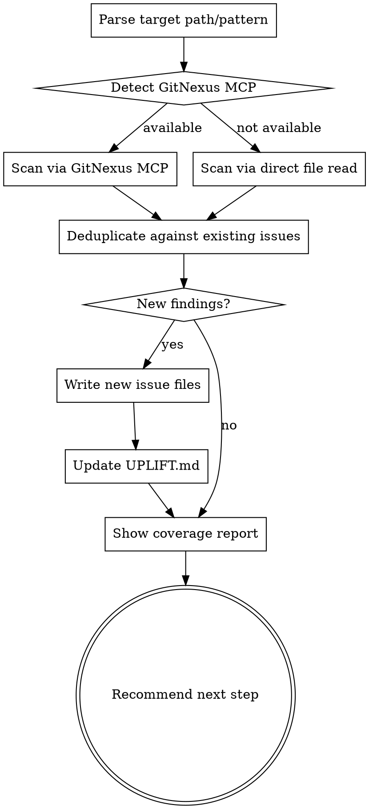

# Uplift Scan

## Overview

Targeted scan of specific paths. Appends findings to existing `docs/uplift/` issue files. Does not replace the previous audit — it extends it.

**Announce at start:** "I'm using the uplift-scan skill to scan `{target}`."

<HARD-GATE>
Do NOT overwrite existing issue files. New findings are appended as new files. Existing files are never modified during a scan.
</HARD-GATE>

<HARD-GATE>
If `docs/uplift/UPLIFT.md` does not exist, tell the user to run `/uplift-audit` first. `/uplift-scan` extends an audit — it does not replace it.
</HARD-GATE>

## Checklist

1. **Parse target** — directory, glob pattern, or file list from the command argument
2. **Detect GitNexus** — check index and MCP registration status
3. **Scan target** — using GitNexus CLI if available, direct reading if not
4. **Deduplicate** — skip any finding that duplicates an existing issue file
5. **Write new issue files** — one per new finding
6. **Update UPLIFT.md** — append new findings to the index
7. **Show coverage report**
8. **Recommend next step**

## Process Flow



## Step-by-Step

### 1. Parse Target

Accept any of:
- Directory path: `/uplift-scan src/payments/`
- Glob pattern: `/uplift-scan "**/*.service.ts"`
- Comma-separated files: `/uplift-scan src/auth/login.ts,src/auth/session.ts`
- No argument: re-scan the directories listed as "not scanned" in the last coverage report

If no argument and no previous coverage report exists: tell the user to provide a target path.

### 2. Detect GitNexus

Run two checks via Bash:

**Check A — Index:**
```bash
ls .gitnexus/ 2>/dev/null && echo "indexed" || echo "not indexed"
```

**Check B — MCP registration:**
```bash
claude mcp list 2>/dev/null | grep -i gitnexus && echo "mcp registered" || echo "mcp missing"
```

Then attempt to call the GitNexus MCP `list_repos` tool. If it responds: MCP is live.

**Decision table:**

| Index | MCP | Mode |
|---|---|---|
| ✓ | ✓ | **GitNexus MCP** — use MCP tools scoped to target |
| ✓ | ✗ | **Direct file read** — index exists but MCP not registered |
| ✗ | ✓ | **Direct file read** — run `npx gitnexus analyze` first |
| ✗ | ✗ | **Direct file read** |

Report status before scanning:
```
Scan method: GitNexus MCP  (index: .gitnexus/ ✓  mcp: live ✓)
```
or:
```
Scan method: direct file read
  Note: {reason}
```

### 3a. Scan via GitNexus MCP (if available)

Run `query` MCP tool for each of the five dimensions, scoped to the target path. Pass the target as a path filter if the tool supports it; otherwise run globally and filter results to files within the target. Parse output to extract file paths, line numbers, and severity signals. If a query returns an error or empty output, note it and fall back to direct read for that dimension only. Do NOT call `gitnexus query` via Bash — it is read-only and broken.

| Dimension | MCP tools | Query approach |
|---|---|---|
| Bugs | `query` | "unhandled promise rejections", "missing null checks before property access", "swallowed errors in catch blocks" |
| Security | `query` + `context` | "string interpolation in SQL or database queries", "routes without authentication middleware", "hardcoded credentials or tokens". Use `context` to confirm callers before filing critical issues. |
| Performance | `query` | "database queries inside loops", "missing pagination or result limits", "synchronous blocking operations" |
| Refactor | `query` | "functions longer than 50 lines", "duplicated code blocks", "deeply nested conditionals" |
| AI-Readiness | `query` | "magic numbers in business logic", "single-letter variable names outside loops", "functions with misleading names" |

Use `impact` on critical findings to assess blast radius before filing.

### 3b. Scan via Direct File Read (fallback)

Read each file in the target path directly. Apply the same five-dimension analysis as `uplift-audit`.

Skip: `node_modules/`, `.git/`, `dist/`, `build/`, `__pycache__/`, `*.min.js`, `*.lock`

### 4. Deduplicate Against Existing Issues

Before writing any new issue file, compare each finding against existing files in `docs/uplift/{category}/`:
- Same file + same line range → duplicate, skip
- Same root cause in different file → new issue, write it
- Already marked `Status: done` → skip

### 5. Write New Issue Files

Same format as `uplift-audit`. Use today's date in the filename:
`docs/uplift/{category}/{YYYY-MM-DD}-{slug}.md`

Tag each new file with a comment at the top to distinguish from the original audit:
```
<!-- Source: uplift-scan {YYYY-MM-DD} target={target} -->
```

### 6. Update UPLIFT.md

**a) UPLIFT.md — three updates:**

Append new findings to the `## Issue Index` section under each category heading. Use the format: `- [Title](path) — severity — status — impact`. Update the `## Summary` count table to reflect new totals. Do not rewrite the file — append only.

**c) Scan Coverage table:** Add a new row to the Scan Coverage table:

```
| {YYYY-MM-DD} | {GitNexus MCP | direct read} | {target path} | {N scanned}/{N total} | {complete | partial} |
```

If the target was fully covered: status = `complete`.
If files were skipped due to context limit: status = `partial`, and add the uncovered paths to the "Gaps" section.

If "Gaps" already lists the target path (from a previous audit), remove that line after successfully scanning it.

This keeps UPLIFT.md as the single source of truth for what has and hasn't been analyzed.

### 7. Show Coverage Report

After scanning, always report what was and wasn't covered:

```
Scan complete: {target}
Method: {GitNexus MCP | direct file read}

Scanned:
  ✓ {N} files analyzed
  ✓ {N} new issues found across {categories}
  ✓ {N} duplicates skipped (already in audit)

Not scanned (outside target):
  {list of sibling directories not included in this scan, if any}

Run /uplift-scan {path} to extend coverage to these areas.
```

### 8. Recommend Next Step

If new issues were found:
```
━━━━━━━━━━━━━━━━━━━━━━━━━━━━━━━━━━━━━━━━
  NEW ISSUES FOUND — NEXT STEP
━━━━━━━━━━━━━━━━━━━━━━━━━━━━━━━━━━━━━━━━
  [1] /uplift-fix      — {N} new issues added
  [2] /uplift-summary  — generate updated report
━━━━━━━━━━━━━━━━━━━━━━━━━━━━━━━━━━━━━━━━
  Enter number or command:
```

If no new issues:
```
━━━━━━━━━━━━━━━━━━━━━━━━━━━━━━━━━━━━━━━━
  SCAN COMPLETE — NEXT STEP
━━━━━━━━━━━━━━━━━━━━━━━━━━━━━━━━━━━━━━━━
  No new issues in {target}.

  [1] /uplift-fix      — work through existing pending issues
  [2] /uplift-summary  — generate updated report
━━━━━━━━━━━━━━━━━━━━━━━━━━━━━━━━━━━━━━━━
  Enter number or command:
```

## Red Flags

| Thought | Reality |
|---|---|
| "I'll update existing issue files with new findings" | Never modify existing files. Write new ones. |
| "GitNexus didn't find anything so the code is clean" | GitNexus MCP queries depend on how you ask. Run direct read as a spot check if results seem sparse. |
| "I'll re-scan the whole project" | Use `/uplift-audit` for full project scans. `/uplift-scan` is for targeted gaps. |
| "I'll skip deduplication, it's faster" | Duplicate issue files corrupt the summary counts and waste fix-skill time. Always deduplicate. |

## Example Invocations

- `/uplift-scan src/payments/`
- `/uplift-scan src/auth/login.ts,src/middleware/session.ts`
- `/uplift-scan "**/*.controller.ts"`
- `/uplift-scan` (re-scans areas listed as uncovered in last coverage report)

## Verification Checklist

Before marking this skill complete:

- [ ] Target was parsed correctly
- [ ] GitNexus availability was checked and reported
- [ ] All 5 audit dimensions were analyzed for the target
- [ ] Deduplication ran — no duplicate issue files created
- [ ] New issue files follow the standard format with source tag
- [ ] `docs/uplift/UPLIFT.md` Issue Index updated with new entries under each category
- [ ] UPLIFT.md was updated (append only — no overwrites)
- [ ] Coverage report was shown
- [ ] No existing issue files were modified
