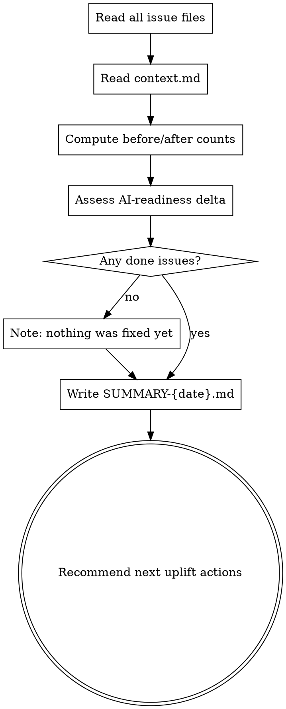

# Uplift Summary

## Overview

Read what was done. Write a clear, honest report. Note what's still pending and why it matters.

**Announce at start:** "I'm using the uplift-summary skill to generate the uplift report."

<HARD-GATE>
Do NOT make any code changes during this skill. Read and report only.
</HARD-GATE>

<HARD-GATE>
If `docs/uplift/` does not exist or contains no issue files and no `UPLIFT.md`, stop. Tell the user to run `/uplift-audit` first — there is nothing to summarize.
</HARD-GATE>

## Checklist

1. **Read all issue files** — all categories, all statuses
2. **Read context.md** — baseline project state
3. **Compute before/after** — issue counts by category and severity
4. **Assess AI-readiness delta** — does a project CLAUDE.md exist now?
5. **Write SUMMARY-{date}.md**
6. **Report next uplift recommendations**

## Process Flow



## Step-by-Step

### 1. Read Issue Index

Read **one file**: `docs/uplift/UPLIFT.md`. Parse the `## Issue Index` section.

Each entry: `- [Title](path) — severity — status — impact`

Use this to compute all counts by category (group by the `### {Category}` sub-heading, count by status). No need to open individual issue files for counting.

For the "What Changed" detail section, read individual files only for entries where `status = done` — typically a small set.

**Fallback:** If UPLIFT.md is missing or has no Issue Index, fall back to reading all individual files under `docs/uplift/{category}/`.

Status values:
- `done` — fixed and verified
- `in-progress` — fix started but not yet complete
- `pending` — found but not yet addressed
- `skipped` — user explicitly declined to fix
- `wont-fix` — intentionally not addressing

If UPLIFT.md does not exist, the audit has not run. Tell the user.

### 2. Read context.md

Read `docs/uplift/context.md` to recall the baseline — stack, test coverage, initial gaps reported at init time.

### 3. Compute Before/After

For each category, count:
- Total issues found
- Issues fixed (`done`)
- Issues remaining (`pending`)
- Issues skipped

### 4. Assess AI-Readiness Delta

- Does `CLAUDE.md` exist at the project root now?
- Were any ai-readiness issues resolved?
- Is the codebase meaningfully more legible than when uplift started?

### 5. Write docs/uplift/SUMMARY-{YYYY-MM-DD}.md

```markdown
# Uplift Summary
Date: {YYYY-MM-DD}
Project: {project name from context.md or directory name}

## What Changed

{For each done issue, one bullet:}
- **{Title}** (`{category}`, {severity}) — {one sentence: what was changed and why it matters}

{If nothing was fixed:}
- No code changes were made this session. Issues were identified but not yet addressed.

## Results

| Category | Found | Fixed | In-Progress | Pending | Skipped |
|---|---|---|---|---|---|
| Bugs | {n} | {n} | {n} | {n} | {n} |
| Security | {n} | {n} | {n} | {n} | {n} |
| Performance | {n} | {n} | {n} | {n} | {n} |
| Refactor | {n} | {n} | {n} | {n} | {n} |
| AI-Readiness | {n} | {n} | {n} | {n} | {n} |

> "Skipped" counts issues the user explicitly declined during a fix skill session.

## Pending Issues

{If any remain:}
{For each pending issue, one bullet:}
- **{Title}** (`{category}`, {severity}) — {one sentence on why it still matters}

{Highlight any critical or high severity issues that are still pending — these carry real risk.}

{If none remain:}
All identified issues have been addressed.

## Skipped Issues

{For each issue file with `**Status:** skipped`, one bullet:}
- **{Title}** — skipped on {date} (user declined when prompted by fix skill)

{If none:}
No issues were explicitly skipped. Note: issues never reviewed by a fix skill remain `**Status:** pending`, not skipped.

## AI-Readiness

{Before:} {No CLAUDE.md | CLAUDE.md existed}
{After:} {CLAUDE.md created | CLAUDE.md updated | No change}

{One or two sentences on whether the codebase is meaningfully more legible to AI agents now.}

## Recommended Next Steps

{Build a prioritized numbered list of ALL remaining work based on pending issue files.
Order: critical/high severity issues first, then medium/low.
For each item, show the command, pending count, and one-sentence reason.}

Example:
1. `/uplift-fix` — 6 issues pending (security has 1 critical: SQL injection, exploitable by any user)

{If all issues are resolved:}
Nothing pending. The codebase is in good shape for now.
```

### 6. Report to User

After writing the file, display a concise version inline:

```
Uplift session complete.

Fixed: {N} issues ({breakdown by category})
Pending: {N} issues ({count of critical/high remaining})
Report saved: docs/uplift/SUMMARY-{date}.md

{If critical/high issues remain:}
⚠ {N} critical/high issues are still pending. These carry real risk if left unaddressed.

Remaining work:
{same numbered list as above, compact version}

━━━━━━━━━━━━━━━━━━━━━━━━━━━━━━━━━━━━━━━━
  Enter number or command:
```

## Red Flags

| Thought | Reality |
|---|---|
| "I'll leave out the pending issues to make the report look better" | The report is for the user, not for appearances. Pending critical issues must be visible. |
| "I'll estimate what was fixed rather than reading the files" | Read every issue file. Don't summarize from memory — sessions are long and context drifts. |
| "Nothing was fixed so I won't write the summary" | A summary of findings with no fixes is still useful. Write it. |
| "I'll make recommendations based on what sounds good" | Base recommendations only on what the issue files actually show. |

## Example Trigger Phrases

- "Summarize what we did"
- "Generate an uplift report"
- "What changed this session?"
- "Give me a summary before I close this"
- "What's still pending?"

## Verification Checklist

Before marking this skill complete:

- [ ] All issue files in all categories were read — not just the ones you remember touching
- [ ] Before/after counts are accurate
- [ ] Pending critical and high issues are clearly visible in the report
- [ ] `docs/uplift/SUMMARY-{date}.md` was written
- [ ] Inline summary was shown to the user
- [ ] Recommendations are based on actual findings, not generic advice
- [ ] No code was changed during this skill
